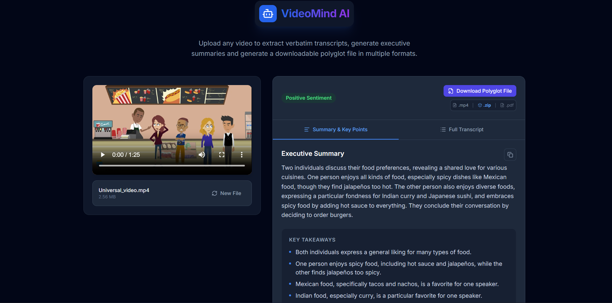
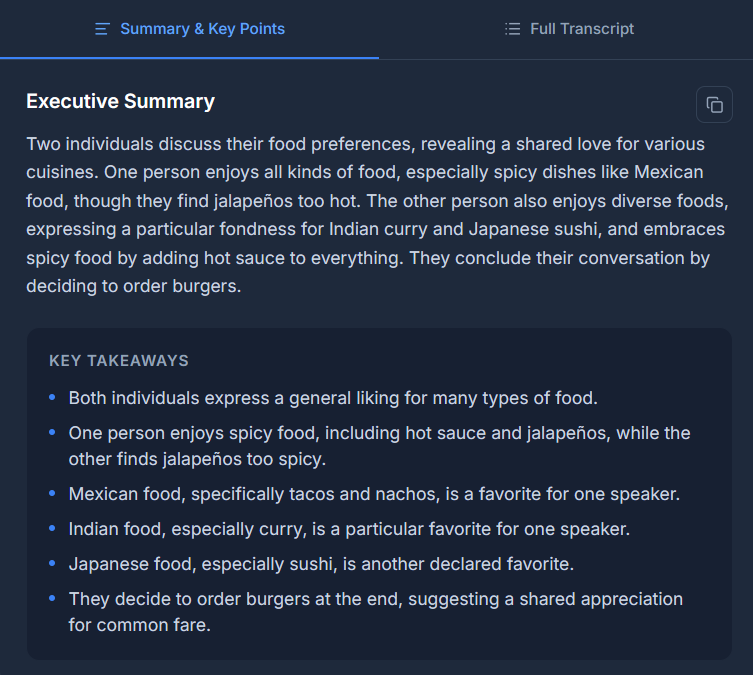
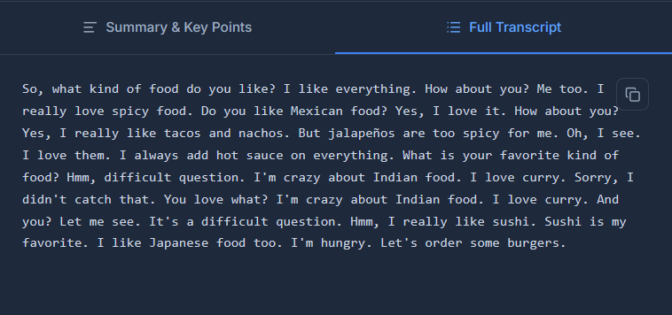
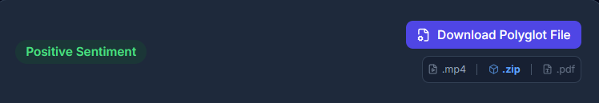

# Polyglot Generator 🧩📁

**Create universal polyglot media files by combining videos, images, PDFs, HTML, and ZIPs into a single downloadable file.**

Polyglot Generator is a modern React + Bun web application that lets you upload a video/audio file and an image, optionally attach PDFs, HTML, ZIPs, or small extra files, and generate a **single polyglot file**. This file can act as a video, image, PDF, HTML page, or ZIP archive depending on its extension.



---

## ✨ Key Features

- **⚡ Instant Polyglot Generation**: Upload video/audio and an image to create a universal file.
- **🖼️ Image Embedding**: Convert images into an ICO container included in the polyglot.
- **📜 PDF Integration**: Include PDF files with automatic offset adjustment.
- **🌐 HTML Support**: Add web pages inside the polyglot for browser display.
- **📞 ZIP Merging**: Merge multiple ZIP-like archives into the final polyglot file.
- **🧩 Polyglot “Magic” File**: A single file that behaves as:
  - **Video** (MP4) when played in a media player  
  - **Image** (ICO) when viewed as an icon  
  - **HTML Page** when renamed `.html`  
  - **PDF** when renamed `.pdf`  
  - **ZIP Archive** when renamed `.zip`  

---

## 🚀 How It Works

1. **Upload Files**: Select your video/audio, image, and optional HTML, PDF, ZIP, or extra files.  
2. **Process**: The backend (Bun + `beheader.js`) converts videos to MP4, images to PNG in ICO containers, and merges optional files.  
3. **Generate Polyglot**: The script manipulates file headers, inserts offsets, and merges ZIPs to produce a single universal file.  
4. **Download**: The generated polyglot file can be used as multiple formats depending on its extension.  

---

## 🌍 Tech Stack

- **Backend**: Bun, Node.js, Express, Multer  
- **Frontend**: React 18, Vite  
- **Styling**: Tailwind CSS  
- **Utilities**:  
  - `ffmpeg` and `ffprobe` for video/audio processing  
  - ImageMagick (`convert`) for image conversion  
  - `zip/unzip` for ZIP handling  
  - `mp4edit` for MP4 atom manipulation  

---

## 📦 Installation

### Backend

```bash
cd backend
bun install express multer
mkdir uploads outputs
bun run server.js
```

> Ensure `beheader.js` and `mp4edit` are in the `backend` folder.

### Frontend

```bash
cd frontend
npm install
npm run dev
```

Open the URL shown in the console (e.g., `http://localhost:5173`).

---

## 🖼️ Screenshots

### Upload & Generate
Upload your video/audio and image to start generating the polyglot file.



### Optional Files
Attach HTML, PDF, ZIP, or extra files to include in the polyglot.



### Polyglot Output
One file, multiple formats depending on the extension.



---

## ⚠️ Notes

- Large video/audio files may take time to process.  
- All dependencies (`ffmpeg`, `convert`, `zip`, `mp4edit`) must be installed on the server.  
- Temporary files are cleaned automatically after generation.  
- PDF offset fixing may occasionally fail but usually remains usable.  

---

## License

MIT License © 2025